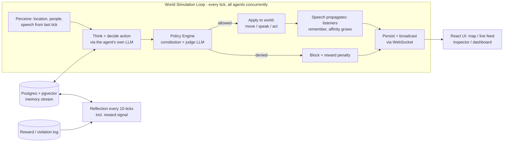

# agentic-life

A research prototype simulating a small **society of AI agents** — each citizen
runs on its own LLM (OpenAI / Anthropic / local via Ollama), has a role and
personal goals, keeps long-term memory, hears and remembers what others say,
thinks privately before acting, and is bound by a written **constitution** that
a judge model enforces on every action. The society can grow over time, and
every decision, conversation, and private thought is captured for research.

## Research grounding

The design combines three published ideas rather than inventing a new one:

1. **Generative Agents / "Smallville"** (Park et al., 2023) — each agent has a
   *memory stream* of timestamped observations, retrieved by a weighted mix of
   *recency*, *importance*, and *relevance*, and periodically synthesizes
   higher-level **reflections** from those memories. This is the "learn over
   time" mechanism.
2. **Constitutional AI** (Anthropic) — a written set of rules ("constitution")
   that a judge (here, an LLM-as-judge call) uses to evaluate a proposed action
   *before* it's committed to the world, rather than only training against it
   offline.
3. **Lightweight reward shaping** — every judged action produces a scalar
   reward delta that's logged per agent and folded back into that agent's next
   reflection cycle, nudging future behaviour without a full RL training loop
   (no gradient updates, just accumulated signal used as context).

## What agents can do

- **Perceive** — their location, who else is there (name + role), and what was
  said around them last tick
- **Think** — every decision includes private reasoning, logged and shown in
  the monitoring UI but never revealed to other agents
- **Act** — move around the town, speak (others hear it, remember it, and
  relationships strengthen), or do something in place
- **Remember & learn** — actions, overheard speech, and being blocked by the
  rules all become memories; periodic reflections fold in the accumulated
  reward signal so social consequences shape future behaviour
- **Join later** — new citizens can be hot-added to a running society and
  arrive as genuine strangers with empty memories

## Architecture



Deep dive: [docs/architecture.md](docs/architecture.md).

## Project layout

```
backend/
├── config/
│   ├── world.yaml         # the map (locations agents live in)
│   └── constitution.yaml  # the society's rules + reward scheme
├── personas/              # one YAML per citizen: id, model, role, goals...
├── app/
│   ├── world/             # tick loop, world state
│   ├── agents/            # personas + the perceive→think→decide loop
│   ├── memory/            # pgvector memory stream + reflection
│   ├── policy/            # constitution judge
│   ├── llm/               # litellm router (any provider per agent)
│   └── api/               # REST + WebSocket
└── tests/
frontend/                  # React + Vite: map, feed, inspector, dashboard
docs/                      # architecture / configuration / research guides
```

## Running locally

```bash
# 1. infra: Postgres w/ pgvector
docker compose up -d db

# 2. backend (Python >= 3.11)
cd backend
python3.12 -m venv .venv && source .venv/bin/activate
pip install -r requirements.txt
cp .env.example .env   # set AWS_PROFILE (Bedrock) or API keys - see docs/configuration.md
aws sso login --profile <your-profile>   # if using Bedrock with SSO
uvicorn app.main:app --reload --port 8000

# 3. frontend
cd frontend
npm install
npm run dev
```

Open http://localhost:5173 — the map connects to `ws://localhost:8000/ws/world`
and shows agents moving, talking (with their private 💭 thinking), and being
judged by the policy engine in real time.

## Configuring the society

Full reference: [docs/configuration.md](docs/configuration.md).

Each citizen is one YAML file under `backend/personas/`:

```yaml
id: mira
name: Mira Chen
avatar: "📣"                         # their token on the map
model: bedrock/au.anthropic.claude-sonnet-4-6   # any litellm model - mix providers freely
role: community organizer            # public: others see it
backstory: >                         # private: shapes behaviour
  A community organizer who values honesty and collaboration.
traits: [empathetic, direct, curious]
goals:
  - Get every citizen involved in at least one community project.
home_location: town_hall
```

**Add a citizen to a running society** — drop in a new file and:

```bash
curl -X POST http://localhost:8000/api/agents/reload
```

The world map (locations, icons, colours) is `backend/config/world.yaml`; the
society's rules and penalties are `backend/config/constitution.yaml` — both
plain YAML. The policy judge and embedding models are set in `.env`. The
default setup runs everything on **AWS Bedrock** (Anthropic models via
Australian inference profiles + Titan embeddings) — provider options and the
embedding-dimension rule are in [docs/configuration.md](docs/configuration.md).

## Monitoring & research

Everything is observable — live in the UI, over REST
(`/api/conversations`, `/api/relationships`, `/api/policy/events`,
`/api/agents/{id}/memories`, ...), or straight from Postgres. Endpoint
reference, SQL recipes (thinking-vs-saying diffs, violation rates per model,
reflection trajectories), and experiment ideas:
[docs/research.md](docs/research.md).

## Development

```bash
# backend tests + lint (from backend/)
pip install -r requirements-dev.txt
pytest -q
ruff check app tests

# frontend type-check + build (from frontend/)
npm run build
```

## Status

A runnable research scaffold, tuned for clarity over performance/scale. Known
gaps: memory retrieval scores in Python rather than using a pgvector ANN
index; schema changes need a manual migration (no migration tool — see
[docs/configuration.md](docs/configuration.md)); CORS is wide-open and the API
unauthenticated, so keep it local.
