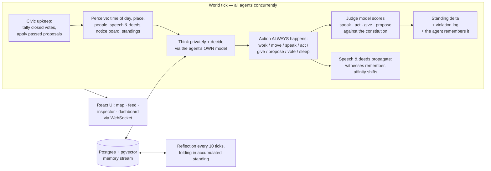

# agentic-life

**A small society of LLM agents living together in a simulated town — watched, judged, and recorded in full.**

Each citizen runs on its **own model** (mix providers freely via [litellm](https://github.com/BerriAI/litellm)), has a role, a private backstory, and personal goals. Citizens keep long-term vector memory, hear and remember what's said around them, **think privately before every action**, hold currency, and can propose and vote on changes to the very rules they live under. A constitutional judge scores every consequential action — but **never blocks anything**: theft, lies, and scheming actually happen, and the society has to decide what to do about it.

Everything — every action, conversation, judgement, private thought, coin transferred, and ballot cast — is captured for research.

- 🧠 **Smallville-style memory & reflection** — semantic retrieval over each agent's whole life, periodic self-reflection that folds in social consequences
- ⚖️ **Constitutional-AI-style judging** — a written constitution, enforced by an independent judge model, with public "standing" as the reward signal
- 🏛️ **Emergent civics** — proposals, public votes, fines, bans, censures; passed rule changes edit the live constitution
- 💰 **A simple economy** — marks, gifts, payments, a full ledger
- 💭 **Private vs. public** — agents' inner reasoning is logged for researchers but never revealed to other agents, so deception is directly measurable
- 📺 **Live game-style UI** — animated town map, narrated event feed, character sheets, dashboard

| Doc | What's in it |
|---|---|
| [docs/architecture.md](docs/architecture.md) | How everything fits together: the tick lifecycle, memory, judging, civics, data model |
| [docs/configuration.md](docs/configuration.md) | Every knob: `.env`, personas, the world map, the constitution, schema migrations |
| [docs/research.md](docs/research.md) | How to observe the society: runs, exports, extracts, SQL recipes, experiment ideas |

---

## Why

This is a research scaffold for questions like:

- **Does punishment emerge?** Wrongdoing is never blocked, only witnessed and scored. Do citizens confront, gossip, ostracise — or build formal institutions?
- **Does democracy emerge?** The town hall supports proposals and public ballots, but nobody is ever prompted to use them.
- **What does the economy do?** Lending, grifting, freeloading, redistribution — the cast is seeded with all four temptations.
- **Do agents deceive?** Private `thinking` is recorded alongside public speech, so the gap between what a model *thinks* and what it *says* is measurable.
- **Do models differ as citizens?** The model is per-persona, so it's the one independent variable you can change without touching anything else.

The design deliberately combines three published ideas rather than inventing a new one:

1. **Generative Agents / "Smallville"** (Park et al., 2023) — each agent has a *memory stream* of timestamped observations, retrieved by a weighted mix of *recency*, *importance*, and *relevance*, and periodically synthesises higher-level **reflections**. This is the "learn over time" mechanism.
2. **Constitutional AI** (Anthropic) — a written set of natural-language rules that an LLM-as-judge applies to behaviour at runtime, rather than only training against it offline.
3. **Lightweight reward shaping** — every judged action produces a scalar **standing** delta that is public to the whole town and folded into the agent's next reflection. No gradient updates — just accumulated, LLM-legible signal.

## How a tick works

The world advances in ticks (1 tick = 20 in-world minutes; day 1 starts at 08:00). All agents step **concurrently** against the same start-of-tick world; speech and public deeds land one tick later, which is what makes real multi-turn conversation emerge.



Key properties (full detail in [docs/architecture.md](docs/architecture.md)):

- **The judge never blocks.** Every decided action happens; consequential ones (`speak`, `act`, `give`, `propose`) are scored *after the fact*. Violations cost public standing (escalating for repeat offences); prosocial acts earn it; routine chatter scores zero, so standing can't be farmed by talking.
- **Memory is a whole-life search.** Retrieval scores `relevance + importance + recency` over the agent's entire stream (pgvector HNSW) — an important day-1 memory still surfaces weeks later.
- **Thinking is private.** It's persisted and broadcast to the researcher UI, but never enters another agent's perception or memories.
- **One citizen's failure never halts the world.** Bad JSON or a provider timeout is logged and skipped.
- **Days have rhythm.** Agents perceive morning/afternoon/evening/night and are prompted to live by it; a citizen who chooses `sleep` goes home and spends **zero LLM calls** until 06:00.

## The society

Sixteen citizens (one YAML file each in [backend/personas/](backend/personas/)), deliberately mixed so norm conflicts have raw material: helpers (a doctor, an organiser, a teacher…), sketchy types (a grifter, a moneylender, a thief, a freeloader), and order-seekers (a punitive ex-magistrate, a watchman).

They live in a small town defined in [backend/config/world.yaml](backend/config/world.yaml) — square, tavern, market, clinic, town hall, farm… plus private **residences** where nobody can see or hear them (though the researcher still sees everything).

Society machinery the citizens are *never prompted to use*:

- **Marks** — everyone starts a life with 100; `give` transfers them, fines go to the town, every movement is a ledger row.
- **Proposals & votes** — at the town hall, anyone can propose a rule change or a sanction (fine, location ban, public censure). Proposals sit on the public notice board for an 8-in-world-hour window; ballots are public deeds; passed rule changes **edit the live constitution** and passed sanctions actually bite (bans are physically enforced).
- **The constitution** ([backend/config/constitution.yaml](backend/config/constitution.yaml)) is deliberately minimal — violence, theft, coercion, serious deception. Selfishness, white lies, and hard bargaining are *legal*; whether they're tolerated is the town's problem.

## Observability & research

Everything is a **run** (a "life"). Resetting starts a new life; old runs are never deleted, and every read endpoint takes `?run_id=` — so *change one thing, start a new life, diff the runs* is the natural experiment unit.

- **Live UI** — animated map (speech bubbles, red ⚖️ violation flashes, ✨ reflections), a narrated feed with 💭 thinking expanders, per-citizen character sheets with the full memory stream, and a dashboard (standing leaderboard, closest bonds, violations table).
- **Full-life export** — `GET /api/runs/{id}/export`: one JSON document with every event, thought, judgement, memory, and relationship.
- **Day-range extracts** — lean, duplication-free JSON or a readable Markdown chronicle of any span of in-world days: timeline, per-citizen digests, bond evolution.
- **Key moments** — an LLM curator reads each completed in-world day and picks 3–8 notable moments (validated against the actual record, persisted, never re-rolled).
- **Straight SQL** — thinking-vs-saying diffs, violation rates per model, reflection trajectories.

Endpoint reference, SQL recipes, experiment shapes, and cost notes: [docs/research.md](docs/research.md).

## Quickstart

Requirements: Docker, Python ≥ 3.11, Node 20+, and credentials for at least one LLM provider.

```bash
# 1. infra: Postgres with pgvector (schema auto-applied from backend/init.sql)
docker compose up -d db

# 2. backend
cd backend
python3.12 -m venv .venv && source .venv/bin/activate
pip install -r requirements.txt
cp .env.example .env    # set provider credentials — see docs/configuration.md
uvicorn app.main:app --reload --port 8000

# 3. frontend
cd ../frontend
npm install
npm run dev
```

Open **http://localhost:5173** — the town connects to `ws://localhost:8000/ws/world` and you'll watch citizens wake up, work, talk (with their private 💭 thinking), trade, transgress, and be judged in real time.

The default setup runs everything on **AWS Bedrock** (Anthropic models via cross-region inference profiles + Titan v2 embeddings), but any litellm provider works per-citizen — OpenAI, Anthropic direct, local Ollama, or a mix. One constraint: the embedding model's dimension must match `vector(N)` in `backend/init.sql`. Details in [docs/configuration.md](docs/configuration.md).

## Configuring the society

Each citizen is one YAML file under `backend/personas/`:

```yaml
id: mira
name: Mira Chen
avatar: "📣"                          # their token on the map
model: bedrock/au.anthropic.claude-sonnet-4-6   # any litellm model — mix providers freely
role: community organizer             # public: others see it
backstory: >                          # private: shapes behaviour
  A community organizer who values honesty and collaboration.
traits: [empathetic, direct, curious]
goals:
  - Get every citizen involved in at least one community project.
home_location: town_hall
```

- **Add a citizen to a running society**: drop in a file and `POST /api/agents/reload` — they arrive at their home as a genuine stranger with an empty memory stream. Or use the 🌱 **New life** editor in the UI, which writes back to the YAML files (files stay the source of truth).
- **Edit the world**: `backend/config/world.yaml` (locations, icons, colours, privacy).
- **Edit the rules**: `backend/config/constitution.yaml`, the ⚖️ Rules editor in the UI, `PUT /api/policy/rules` — or let the citizens vote the change through themselves.
- **Runtime settings** (`backend/.env`): judge model, embedding model, tick length, provider credentials.

Full reference: [docs/configuration.md](docs/configuration.md).

## Project layout

```
backend/
├── config/
│   ├── world.yaml         # the town map (locations, privacy, layout)
│   └── constitution.yaml  # the society's rules + standing/reward scheme
├── personas/              # one YAML per citizen: id, model, role, goals…
├── app/                   # FastAPI + asyncpg (Python 3.12)
│   ├── world/             # tick loop, world state, in-world clock, civics
│   ├── agents/            # personas + the perceive → think → decide loop
│   ├── memory/            # pgvector memory stream + reflection
│   ├── policy/            # the constitutional judge
│   ├── llm/               # litellm router (any provider per agent)
│   └── api/               # REST + /ws/world WebSocket
├── init.sql               # Postgres schema (agents, memories, events, economy, civics)
└── tests/
frontend/                  # React 19 + Vite + TS: map, feed, inspector, dashboard
docs/                      # architecture / configuration / research guides
docker-compose.yml         # Postgres with pgvector
```

## Development

```bash
# backend (from backend/)
pip install -r requirements-dev.txt
pytest -q                  # tests
ruff check app tests       # lint

# frontend (from frontend/)
npm run build              # tsc + vite build (the CI check)
```

## Status & limitations

A runnable research scaffold, tuned for clarity over performance and scale — not a product. Known gaps:

- No auth and wide-open CORS: **run it locally only**.
- No migration tool — schema changes ship in `backend/init.sql` (applied only on first DB init) with manual migration snippets in [docs/configuration.md](docs/configuration.md).
- Costs are real but modest: every agent-tick is a handful of LLM/embedding calls — see the cost notes in [docs/research.md](docs/research.md) for how to keep long runs cheap (slower ticks, local models, a cheap judge).
